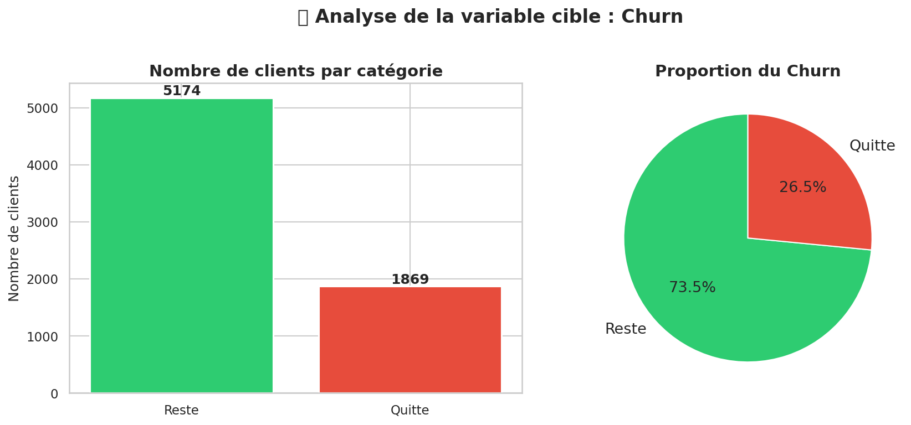
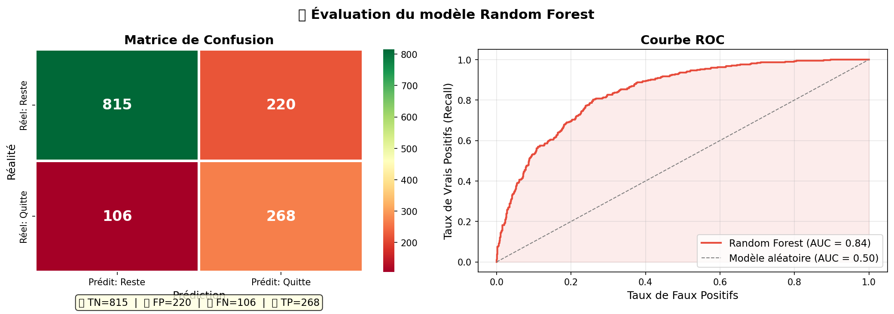
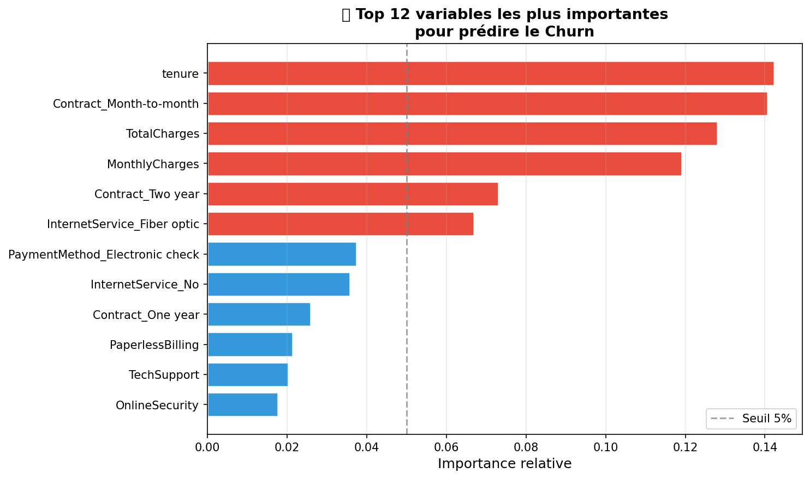

# 📉 Customer Churn Prediction

Prédiction du churn client avec Machine Learning (Random Forest)  
sur le dataset Telco Customer Churn d'IBM.

---

## 🎯 Objectif

Identifier en avance les clients susceptibles de quitter 
une entreprise de téléphonie, afin de permettre des actions 
de rétention ciblées.

---

## 📊 Résultats du modèle

| Métrique     | Score  |
|--------------|--------|
| Accuracy     | 76.9%  |
| ROC-AUC      | 84.0%  |
| Recall Churn | 72.0%  |
| F1-Score     | 62.0%  |

---

## 🔍 Insights clés découverts

- **26.5%** des clients ont churné (dataset déséquilibré)
- Les clients avec contrat **Month-to-month** churent à **42.7%**
- Les clients avec contrat **Two year** churent à seulement **2.8%**
- Les clients avec **Fiber optic** churent à **41.9%**
- Les 2 mois suivant l'inscription sont la période **la plus critique**
- Les variables **tenure**, **type de contrat** et **charges financières** 
  sont les 3 meilleurs prédicteurs

---

## 🤖 Exemple de prédiction

```python
# Client à risque : 2 mois, contrat mensuel, fibre, 85$/mois
probabilite_churn = 88.3%
→ Action recommandée : contacter immédiatement
```

---

## 🛠️ Stack technique

- **Python 3** — langage principal
- **Pandas / NumPy** — manipulation des données
- **Matplotlib / Seaborn** — visualisation
- **Scikit-learn** — modèle Random Forest, évaluation
- **Google Colab** — environnement de développement
- **Joblib** — sauvegarde du modèle

---

## 📁 Structure du projet

├── churn_prediction.ipynb   # Notebook complet

├── random_forest_churn.pkl  # Modèle entraîné

├── scaler_churn.pkl         # Scaler de normalisation

└── images/                  # Visualisations

---

## 📋 Pipeline complet
Données brutes (7043 clients, 21 features)

          ↓

Exploration (EDA) — distribution, corrélations, insights

          ↓

Nettoyage — valeurs manquantes, encodage, normalisation

          ↓

Modélisation — Random Forest (100 arbres, class_weight=balanced)

          ↓

Évaluation — Matrice de confusion, ROC-AUC, Classification report

          ↓

Prédiction — Score de risque par client (0% → 100%)

---

## 📈 Visualisations

### Distribution du Churn


### Évaluation du modèle


### Variables les plus importantes


---

## 👤 Auteur

**Mohamed Lamine**  
Ingénieur IA & Data Science  
[LinkedIn](#) · [GitHub](#)

---
